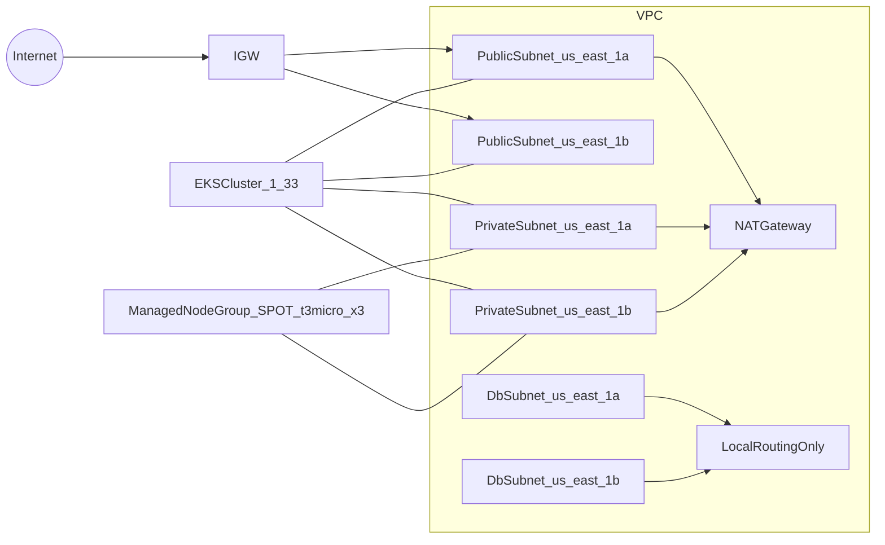

# projeto-eks (Terraform)

Projeto pessoal em Terraform para provisionar na AWS (`us-east-1`) uma **VPC** com subnets públicas/privadas/banco, um **cluster EKS v1.33** e um **repositório ECR** para armazenar imagens e fazer deploy no EKS.

## O que será criado
- **Rede**
  - 1× VPC
  - 2× subnets públicas (`us-east-1a`, `us-east-1b`)
  - 2× subnets privadas (`us-east-1a`, `us-east-1b`)
  - 2× subnets de banco (isoladas, sem rota para internet)
  - 1× Internet Gateway + route table pública com rota `0.0.0.0/0 -> IGW`
  - 1× NAT Gateway (único) + route table privada com rota `0.0.0.0/0 -> NAT`
- **EKS**
  - 1× cluster EKS (Kubernetes `1.33`)
  - 1× managed node group: `SPOT`, `t3.micro`, 3 nós
- **ECR + IAM**
  - 1× repositório ECR
  - 1× role IAM para GitHub Actions (OIDC) fazer push no ECR
  - AWS Load Balancer Controller instalado automaticamente no cluster (Helm via Terraform)

## Arquitetura (alto nível)


## Estrutura do repositório
- `modules/`
  - `vpc/`: VPC + subnets + IGW + NAT + route tables
  - `eks/`: EKS + IAM + managed node group
  - `ecr/`: repositório ECR + lifecycle policy (limpeza de imagens antigas)
  - `iam_github_oidc/`: OIDC provider (se necessário) + role/policy para GitHub Actions -> ECR
- `environments/personal/`: composição do ambiente (chama os módulos, backend remoto, outputs)

## Backend remoto do Terraform (S3)
O state fica em:
- bucket: `rgtrovao-terraform-bucket`
- key: `projeto-eks/personal/terraform.tfstate`
- region: `us-east-1`

**Importante**: este projeto está configurado **sem DynamoDB lock** (por requisito). Evite executar `terraform apply` simultaneamente em duas máquinas/sessões para não corromper o state.

## Como executar (manual)
Entre no ambiente:
```bash
cd environments/personal
terraform init -upgrade
terraform apply
```

Depois do `terraform apply`, publique o portfolio no cluster:
```bash
aws eks update-kubeconfig --region us-east-1 --name projeto-eks-personal
kubectl apply -f k8s/apps/portfolio-nginx/
```

Para destruir:
```bash
cd environments/personal
terraform destroy
```

## Custos (avisos)
- **EKS** possui custo fixo do control plane (por hora) + custos de recursos (nodes, NAT, tráfego, etc.).
- **NAT Gateway** costuma ser um dos itens mais caros em laboratórios pequenos (custo/hora + por GB). Aqui usamos **apenas 1** NAT para reduzir custo.
- **SPOT** reduz custo, mas pode haver interrupções. Ajuste `min/max` ou estratégias se precisar de mais resiliência.

## ECR + GitHub Actions (OIDC)
Este projeto cria uma role IAM que pode ser assumida pelo GitHub Actions (OIDC) para fazer push das imagens no ECR.

- Você precisa definir:
  - `github_org`
  - `github_repo`

Você pode copiar o exemplo e ajustar:
```bash
cp environments/personal/terraform.tfvars.example environments/personal/terraform.tfvars
```

Os outputs importantes após o apply:
- `ecr.repository_url`
- `github_actions.role_arn`
 - `ecr_repository_url` (output direto)
 - `github_actions_ecr_role_arn` (output direto)

Exemplo de workflow (simplificado):
```yaml
name: build-and-push
on:
  push:
    branches: [ "main" ]
permissions:
  id-token: write
  contents: read
jobs:
  build:
    runs-on: ubuntu-latest
    steps:
      - uses: actions/checkout@v4
      - uses: aws-actions/configure-aws-credentials@v4
        with:
          aws-region: us-east-1
          role-to-assume: ${{ secrets.AWS_ROLE_ARN }}
      - uses: aws-actions/amazon-ecr-login@v2
      - env:
          ECR_REPOSITORY_URL: ${{ secrets.ECR_REPOSITORY_URL }}
        run: |
          docker build -t app:${{ github.sha }} .
          docker tag app:${{ github.sha }} $ECR_REPOSITORY_URL:${{ github.sha }}
          docker push $ECR_REPOSITORY_URL:${{ github.sha }}
```

## Segurança (recomendado)
- Restrinja `cluster_endpoint_public_access_cidrs` em `environments/personal/variables.tf` para o seu IP (`x.x.x.x/32`), evitando expor o endpoint público do cluster.

